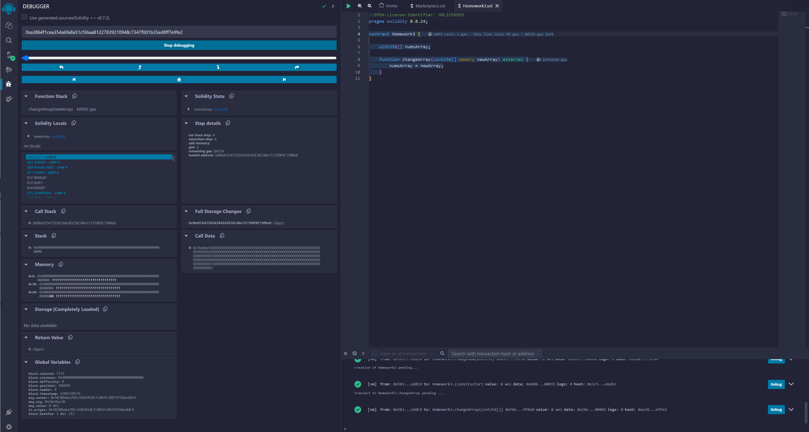
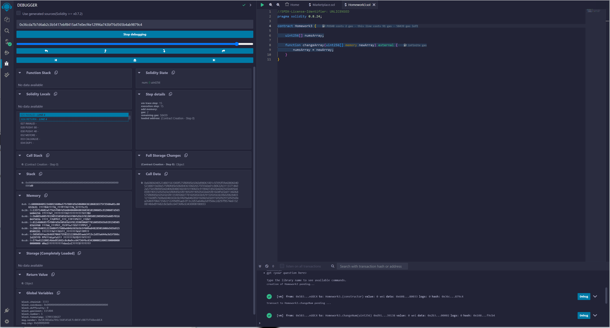

# ExpertSolidityBootcamp

## Homeworks from the Expert Solidity Bootcamp 24 Cohort 1 Encode Club https://www.encode.club/expert-solidity-bootcamp

### HomeWork3

- 1. What are the advantages and disadvantages of
     the 256 bit word length in the EVM?

Each EVM stack item has a size of 256 bits (32 bytes). This facilitates the keccak256 hashing scheme and elliptic curve calculations.

The space available in each slot is 256 bits, although much less would be needed, and the rest of the space would be filled with zeros. This lack of flexibility produces a certain lack of efficiency in the use of memory, which results in increased costs.

- 2.  What would happen if the implementation of a
      precompiled contract varied between Ethereum
      clients ?

This precompiled contracts makes the EVM more efficient and achieve greater performance with certain calculations, such as hash calculations, and lower gas costs to help the rest of the contracts. With different implementations in each client, mismatches could occur between the resulting values, which would compromise the stability and security of the entire network.

- 3. Using Remix write a simple contract that uses a
     memory variable, then using the debugger step
     through the function and inspect the memory

