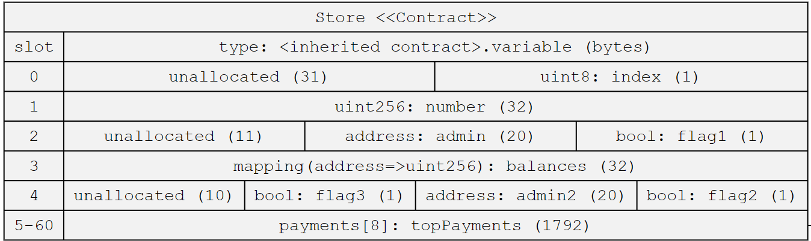
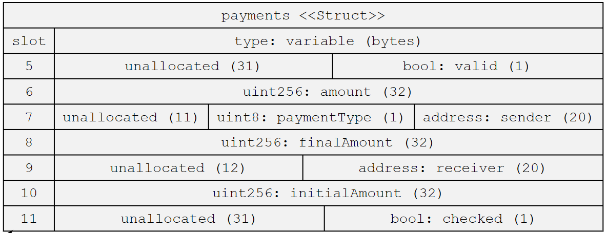
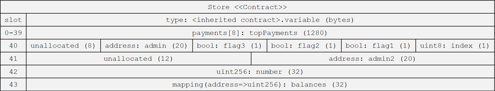
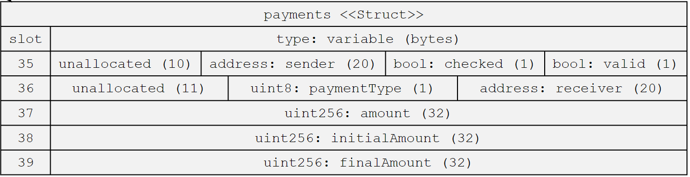
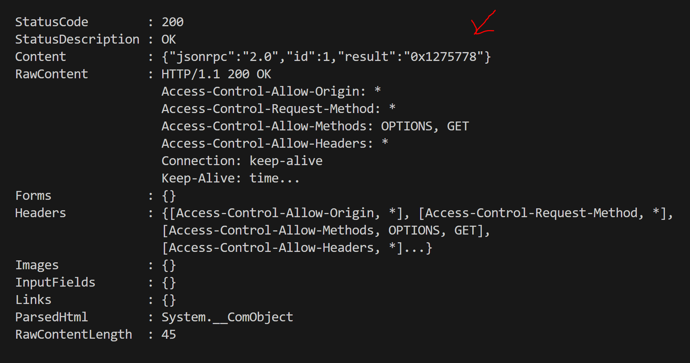

# ExpertSolidityBootcamp

## Homeworks from the Expert Solidity Bootcamp 24 Cohort 1 Encode Club https://www.encode.club/expert-solidity-bootcamp

### HomeWork4

#### Optimising Storage

- Use the sol2uml tool to find out how many storage
  slots it is using.
- By re ordering the variables, can you reduce the
  number of storage slots needed ?

- 1. Memory use in contract Store before optimization

- 2. Memory use in contract Store after optimization

#### Try out the Solidity Template or the Foundry Template

- 1. Start a new project using the Solidity Template
- 2. Make a fork of mainnet from the command line
     (you may need to setup an Infura or Alchemy
     account)
- 3. Query the mainnet using the command line to
     retrieve a prope

