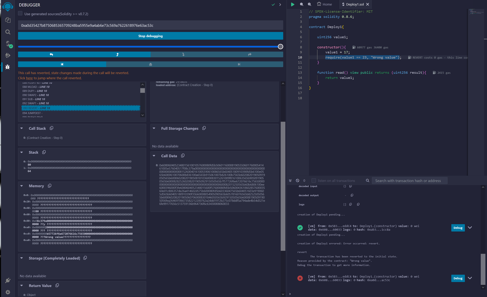

# ExpertSolidityBootcamp

## Homeworks from the Expert Solidity Bootcamp 24 Cohort 1 Encode Club https://www.encode.club/expert-solidity-bootcamp

### HomeWork5

#### Assembly 1

Look at the example of init code in today's notes
See https://gist.github.com/extropyCoder/4243c0f90e6a6e97006a31f5b9265b94

1. When we do the CODECOPY operation, what are we overwriting ?
   (debugging this in Remix might help here)

- When do the CODECOPY operation we are copying the initcode on the memory of the EVM.The initcode is the code that initializes our contract.

2. Could the answer to Q1 allow an optimisation ?

- The initcode runs the constructor, and load the rest of the bytecode into memory. How contract variables and memory usage are optimized will influence the memory needed later in the EVM.

3. Can you trigger a revert in the init code in Remix ?

- 

##### Can you think of a situation where the opcode EXTCODECOPY is used ?

Verification: Contracts use EXTCODECOPY to inspect the bytecode of another contract, enabling them to make decisions based on its contents before interaction.

Contract Upgrades: In upgradeable contract patterns, a contract employs EXTCODECOPY to copy new code from another contract, facilitating dynamic and upgradeable smart contracts.
